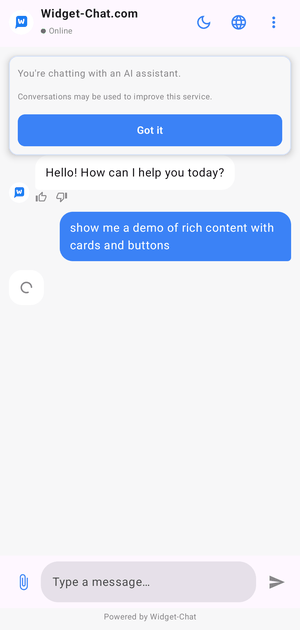

# WidgetChat — Android SDK

> **Drop-in AI chat widget for Android (Jetpack Compose).** Add an AI chatbot to any Android app in
> minutes — themed, multilingual, with rich content and a no-code dashboard.

[](https://jitpack.io/#tajaouart/WidgetChat-Android)
[](https://developer.android.com)
[](https://developer.android.com/jetpack/compose)

Native **Jetpack Compose** SDK for [Widget-Chat](https://widget-chat.com) — a drop-in AI chat widget
for Android. Same backend and no-code dashboard as the Flutter, iOS, and web clients; rendered
natively with Compose (no webview).

<p align="center"></p>

## Install (JitPack)

**settings.gradle.kts**
```kotlin
dependencyResolutionManagement {
    repositories {
        google()
        mavenCentral()
        maven { url = uri("https://jitpack.io") }
    }
}
```

**app/build.gradle.kts**
```kotlin
implementation("com.github.tajaouart:WidgetChat-Android:0.0.1")
```

## Usage

```kotlin
import com.widgetchat.app.WidgetChat

setContent {
    WidgetChat(
        secretKey = "YOUR_PROJECT_KEY",   // from the dashboard (public, safe to ship)
        userId = currentUser.id,
    )
}
```

Optional parameters: `baseUrl`, `isReadOnly`, `modifier`.

## Requirements

- minSdk 26, compileSdk 34
- Jetpack Compose · Kotlin 2.0
- JDK 17

## Features

Dashboard-driven theming (light/dark, colors, avatar) · markdown & code · rich content
(cards, carousels, product lists, images, button groups, swatches) · image attachments ·
typing indicator · good/bad rating + report · sticky AI disclosure & consent · 100+ languages
with a locale picker · quota handling · message history.

## License

Proprietary — © Widget-Chat. See [LICENSE](LICENSE).
